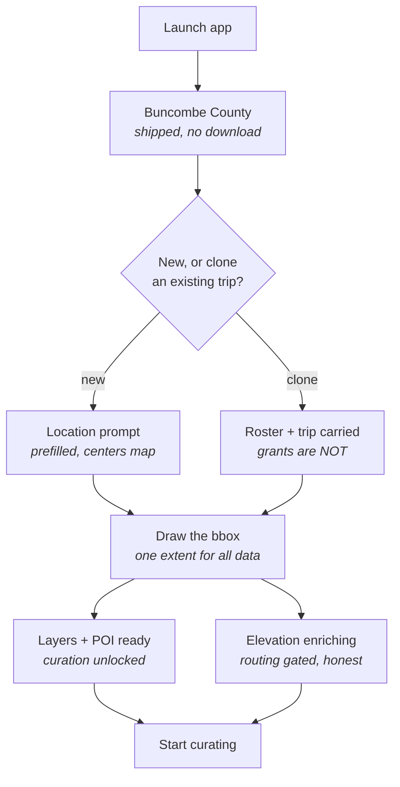
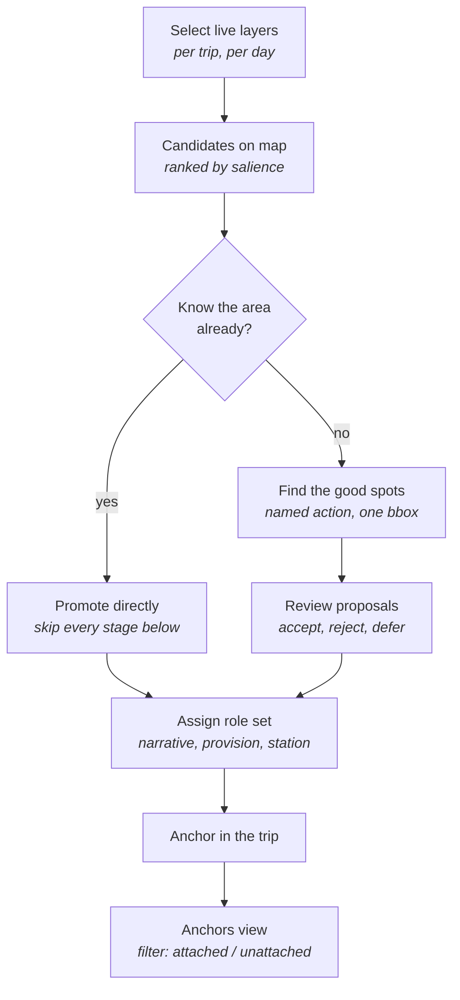
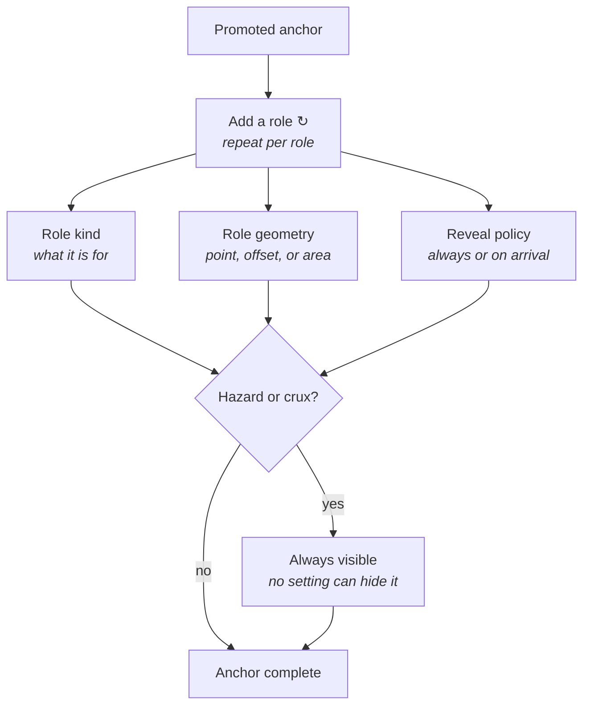
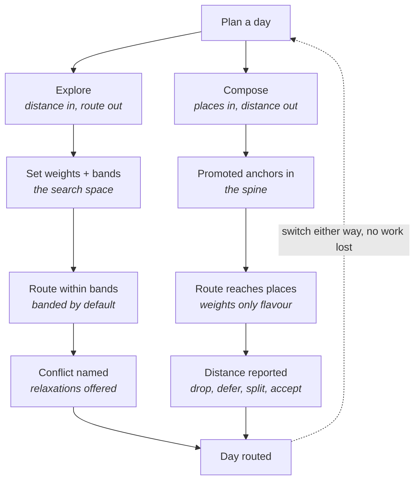
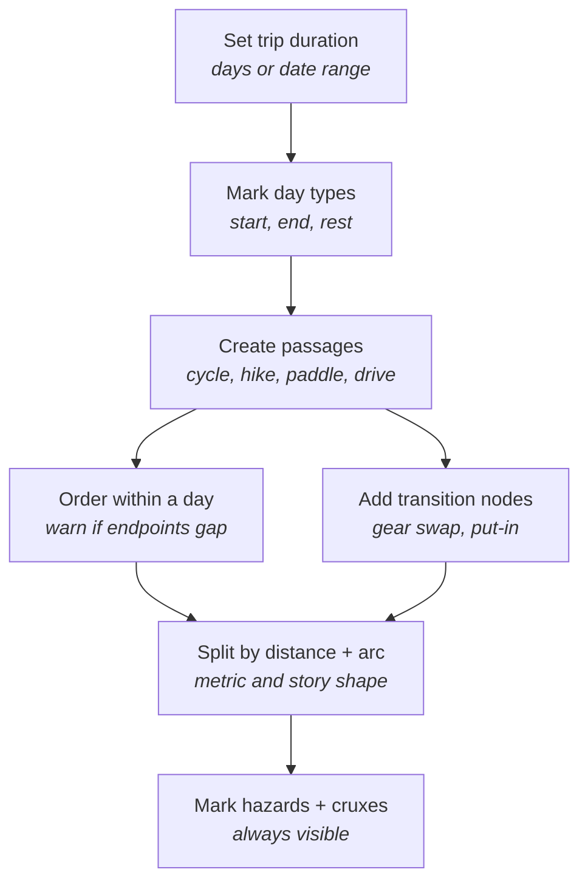
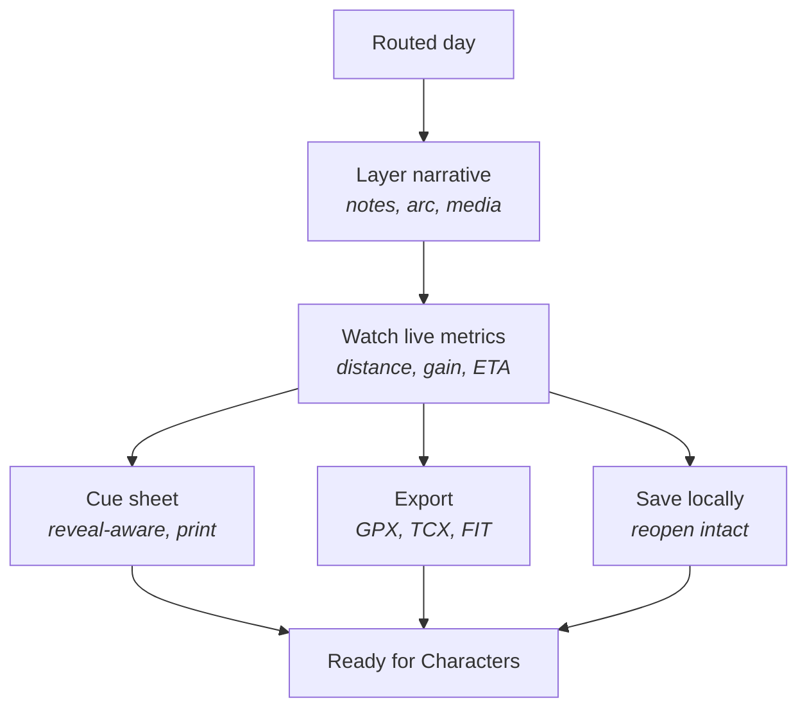
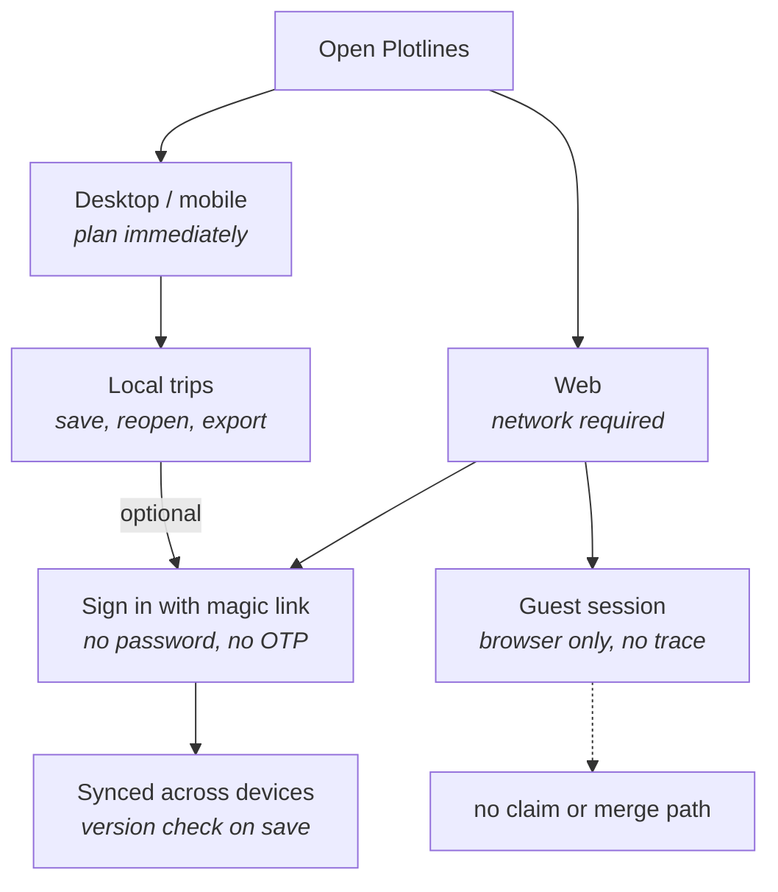
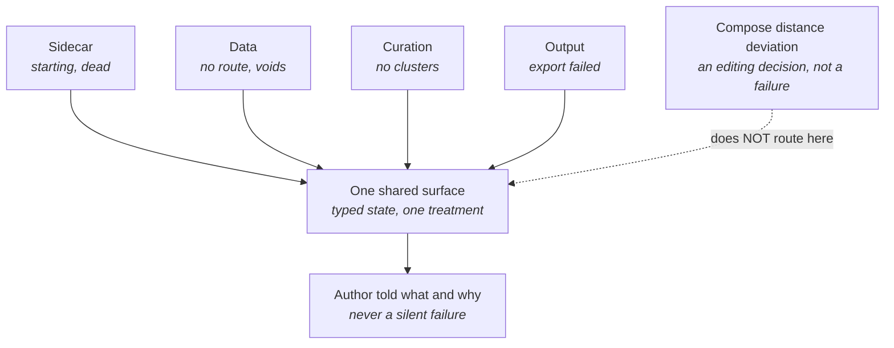
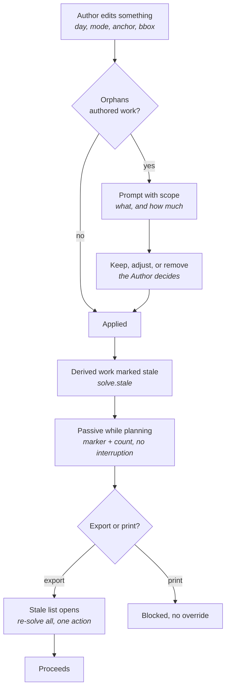
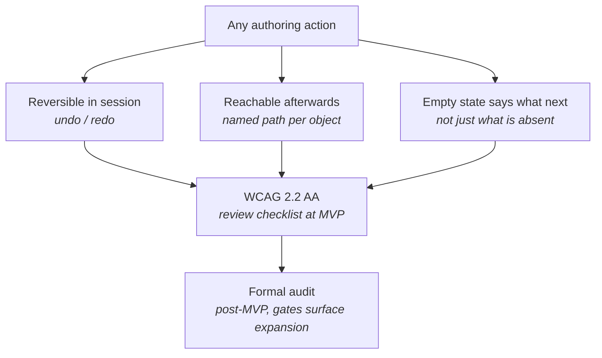

# Plotlines — Author Flows (MVP)

**Version:** 1.2
**Companion to:** `Plotlines_PRD_v2.md` (source of truth), `Plotlines_ARCHITECTURE_v2.md`, `Plotlines_MVP_Redirection_Punchlist.md`
**Scope:** Every **[MVP]** Author story in PRD v2.0, plus the account, error, and edit behaviours that cut across them.

Diagrams are Mermaid so they version-control, diff, and render in the repo. Each carries a traceability table mapping every node to its FR and story. **Where a node has no FR, that is a gap and it is marked as one** — flows 8 and 9 contain most of these.

**Reading order:** flows 1–6 are the Author's happy path in sequence. Flows 7 and 10 cut across all of them. Flows 8 and 9 are the behaviours a happy-path reading misses, and are the two most likely to be built wrong or not at all.

> **v1.1 —** flow 9's rule is now specified (FR139–FR141, FR140a, Epic Q) rather than proposed, and flow 10 is new. The gap flow 9 exposed was not really about editing: **the PRD specified capabilities without reachability.** Flow 10 covers the rule that prevents a repeat.

---

## Flow 1 — Trip initiation

| Node | FR | Story | Note |
|---|---|---|---|
| Buncombe County | FR96 | A10 | A constant, not a default. No override, no prompt, **no download**. |
| New, or clone? | FR74 | G2, N1 | **Cloning is the MVP answer for a recurring group** — last year's paddling crew, their group assignments, and the trip to edit down. Named travel circles (FR143, D9) are Later. |
| Clone: roster + trip carried | FR74 | G2 | Carries roster membership, group assignments, and the whole authored trip. **Never carries profile grants or arrival visibility** — each Character re-grants per trip (K2), or cloning becomes a consent-laundering path. Author notes follow the person automatically (D6), no rule needed. A clone brings its own bbox, so it skips the location prompt. |
| Location prompt | FR96 | A10, N1 | Prefilled last-used, freely editable. **Centers the map only** — never becomes the bbox. |
| Draw the bbox | FR120 | N1 | Bounds layers, clusters, tiles, elevation. Revisable — see flow 9. |
| Layers + POI ready | FR121, FR97 | N2, N3 | Ordered **ahead of** elevation. Per-layer state for plugin layers. |
| Elevation enriching | FR121, FR91 | N2, M12a | Background. Routing disabled with a stated reason, never a silent failure. |

**Invariant:** there is never a *second, different* extent for analysis. That is what "one bbox" means — not that it is fixed.

---

## Flow 2 — Curation and promotion

| Node | FR | Story | Note |
|---|---|---|---|
| Select live layers | FR97, FR100, FR101 | N3, N5 | Defaults vary by **mode × day-type** and are config, not code. |
| Candidates on map | FR98, FR99 | N3 | Salience is a score, not a verdict. Sub-weighted `historic=*`. |
| Know the area already? | — | N3, §5 | **Skippability is the rule, not a shortcut.** Every stage below this is assistance. |
| Find the good spots | FR102, FR105a | N4 | Named Author action over the bbox. **Never ambient on viewport change.** |
| Review proposals | FR103–FR105a | N4a | Cards, contributing features with salience, bulk reject, rejections remembered. |
| Assign role set | FR105, FR106, FR110 | O1 | Roles proposed by **affinity union**; always editable. |
| Anchor in the trip | FR106 | O1 | Copies from its candidate — **never references it** (survives a cache wipe). |
| Anchors view | FR139, FR142(b) | N4a, Q2, K12 | **The workspace has three views, not two:** candidates, proposals, anchors. Unattached anchors (flow 9) are **ordinary working state, not a problem queue** — not badged, not counted as errors, blocking nothing. |

---

## Flow 3 — Roles, geometry and reveal

| Node | FR | Story | Note |
|---|---|---|---|
| Add a role ↻ | FR106 | O1 | Roles are a **set, not a type**. One anchor, one arrival, N roles. |
| Role kind | FR106, FR109 | O1, O4 | narrative (plot point) / provision / station. |
| Role geometry | FR107, FR108 | O2, O3 | Optional offset from the anchor; polygons first-class. |
| Reveal policy | FR114 | O5 | Provision defaults always-visible; narrative and station are the Author's choice. |
| Hazard or crux? → always visible | FR115 | O5, C11 | **Hard constraint, enforced in the model.** No Author can hide one. |

---

## Flow 4 — Explore and compose

| Node | FR | Story | Note |
|---|---|---|---|
| Explore / Compose | FR117 | A0 | |
| Set weights + bands | FR2–FR6, FR5 | A1–A5 | `interest` is a **scalar salience bias** — no POI type parameter. |
| Promoted anchors in | FR8a, FR39 | A9, E3 | Compose **is** the POI-spine trip, not a variant. |
| Route within bands | FR8, FR6 | A8 | Banded by default; never dropped from the explore constraint set. |
| Route reaches places | FR118, FR128 | A0a, A11 | Weights flavour connections. **Routes are mode-legal** (A11 applies to both columns). |
| Conflict named | FR9 | A6 | Async diagnosis — solve returns first, conflict follows. |
| Distance reported | FR118 | A0a | **Not an error, not a conflict dialog.** See flow 8. |
| switch either way | FR119 | A0 | Both directions, per day, no work lost. |

---

## Flow 5 — Multimodal day composition

| Node | FR | Story | Note |
|---|---|---|---|
| Set trip duration | FR17 | C1 | **Editing this later is flow 9.** |
| Mark day types | FR18 | C2 | Rest days are a primary case for area anchors (O3). |
| Create passages | FR10, FR29, FR130 | B1, C13 | Traversal modes only. **Driving is routed**, not a note. Station activities are O4. |
| Order within a day | FR11 | B2 | |
| Add transition nodes | FR12 | B3 | |
| Split by distance + arc | FR19, FR38 | C3, O6 | **Both** the metric and the arc shape — a day may close at a resolution anchor. |
| Mark hazards + cruxes | FR27, FR115 | C11 | Never subject to reveal. |

---

## Flow 6 — Narrative layering and outputs

| Node | FR | Story | Note |
|---|---|---|---|
| Layer narrative | FR37, FR38 | E1, O6 | Content attaches to a **role**, not a place — that is what makes per-role reveal possible. |
| Watch live metrics | FR31, FR16b | D1 | Station durations count toward elapsed time. |
| Cue sheet | FR46, FR116, FR133 | F1 | Reveal-inherited; logistics in the **narrative register**, not a separate panel. |
| Export | FR44, FR45, FR140 | F3, Q3 | **Reveal-aware** — an unrevealed note must not ride out in a waypoint description. **Also stale-gated** (flow 9): an export attempt on stale work opens the stale list rather than producing a file, and **print blocks with no override**. |
| Save locally | FR74a | G2a | Reopen must restore anchors, roles, reveal settings intact. |

---

## Flow 7 — Account and session

| Node | FR | Story | Note |
|---|---|---|---|
| Desktop / mobile → Local trips | FR74a | G2a, K4 | Local planning works with **no sign-in and no network**. |
| Web | FR61 | K4 | The stated exception to local-first. Web *planning* is scoped; **web *reading* is not** (FR132). |
| Guest session | FR60 | K4 | **No server-side trace.** Not "minimal" — none. |
| Sign in | FR57 | K1 | Magic link is the only auth **and the only recovery path**. |
| Synced | FR58, FR59 | K3 | Version check at open **and again at save** — the save-time check is the one usually omitted. |
| no claim or merge | §6.2 non-goal | — | Guest→account claim is an explicit non-goal. Drawn so nobody builds it by accident. |

---

## Flow 8 — Error and empty states

| State | FR | Story | Note |
|---|---|---|---|
| Sidecar starting / won't start / died | FR91, FR121 | M12, M12a, M13 | Restart **once**, then degrade honestly. Cached trips stay viewable. |
| Capability warming | FR121 | N2, M12a, M13 | Per-capability, and **per-layer** inside the layers capability. |
| No route possible | FR9 | A6, M13 | Names the conflict; offers relaxations. |
| No data for the area | — | M13 | |
| Elevation void / missing tile | FR88 | M10, M13 | Resolves to `0.0`, logged once per raster. Never raises, never blocks. |
| Layer extraction failed | — | M13 | **New v2.0 state.** |
| Plugin layer unloadable on licence | FR101 | N5, M13 | Refused at **registration**, not warned at render. |
| No clusters found in bbox | FR102 | N4, N4a, M13 | Says so, and suggests widening layers or bbox. |
| Export failed | — | M13 | |
| *Compose distance deviation* | FR118 | A0a | **Explicitly not an error.** Routing it here re-teaches the Author that curation is a failure mode. |

**Two things sit deliberately outside this surface, and they are the same mistake in different clothes.** Compose-mode distance deviation (FR118) and **stale derived work** (FR140a, flow 9). Both are states the Author caused on purpose, and both carry their own resolution. Routing either through M13's typed enum teaches the Author that ordinary work produces errors.

**Gap:** "no data for the area", "layer extraction failed", and "export failed" have **no FR** — they exist only as entries in M13's state enum. Acceptable if M13 is treated as their requirement; worth an FR if not.

---

## Flow 9 — Editing and cascades

*Specified in v1.1. **Authored work** is what the Author typed, drew, promoted, or arranged. **Derived work** is what Plotlines computed from it. Orphaned authored work prompts; invalidated derived work goes stale.*

| Node | FR | Story | Note |
|---|---|---|---|
| Author edits something | FR139 | Q1, Q2 | Every created object has a matching edit and remove. Days **insertable mid-trip**. |
| Orphans authored work? | FR139 | Q1, Q2 | **Triggered by authored content, not object type** — removing a never-written anchor applies without a prompt. |
| Prompt with scope | FR139 | Q1, Q2 | States what and how much. Generalizes two prior one-off decisions: FR120 bbox shrink, FR81 compose reset. |
| Keep, adjust, or remove | FR139 | Q1, Q2 | Passage removal leaves **anchors alive and unattached** (flow 2's anchors view). |
| Derived work marked stale | FR140 | Q3 | Reuses `solve.stale` (ARCH D30, reach widened by D52). **Nothing recomputes on its own.** |
| Passive while planning | FR140 | Q3 | Marker + dashboard count. **Six edits in a row interrupt zero times.** |
| Stale list opens | FR140, FR140a | Q3 | **Its own surface, not M13's error surface** — stale work is pending work, not a failure. Re-solve-all is **one unconfirmed action**. |
| Blocked, no override | FR140 | Q3 | A stale GPX is corrected by the next sync; a stale printed cue sheet is believed for eight hours. |

### The two cases already decided

| Case | Decided in | Behaviour |
|---|---|---|
| Shrink the trip bbox | FR120 / N1 | Prompt with affected anchors; keep / adjust / remove explicitly. |
| Reset planning controls in compose | FR81 / K8 | Clears route and weights; **does not discard promoted anchors**. |

Both are the same rule. Flow 9 generalizes it rather than adding a third special case.

### The cases still open

| Edit | What it orphans | Resolution |
|---|---|---|
| Reduce day count | days with passages, anchors, arc | **FR139** — prompt, then merge or remove |
| Remove a passage | its anchors, transitions, cue segment | **FR139** — anchors survive unattached |
| Remove an anchor | arc stage, compose spine, day split | **FR139** — day holds bounds, route goes stale |
| Change a passage's mode | routability, surface weights, cue types | **FR140** — `solve.stale`, no cascade prompt |
| Remove a layer | candidates for that layer | **Already answered** — promoted anchors copy, never reference (FR106) |

---

## Flow 10 — Foundational usability

*Cuts across every flow above. The flow-9 review exposed that the PRD specified **capabilities without reachability** — unattached anchors were one instance of a class, and patching instances one at a time is the pattern that produced eighteen recovered concepts.*

| Node | FR | Story | Note |
|---|---|---|---|
| Reversible in session | FR142(a) | K12 | Bounded payload snapshots — cheap because `trip.payload` is already one canonical serializable blob (ARCH D28). **Excludes** note deletion (FR135a, irreversible by design) and derived work (re-solving is idempotent). |
| Reachable afterwards | FR142(b) | K12 | Verified against an **enumeration**, not asserted: anchor (attached/unattached), passage, day, trip, note, group, stale item. **A new object type ships with its path named, or it does not ship.** |
| Empty state says what next | FR142(c) | K12 | Distinct from *no clusters found* (a **result**, flow 2) and from M13's states (**failures**, flow 8). |
| WCAG 2.2 AA | FR142(d) | K12 | Current W3C Recommendation and ISO/IEC 40500:2025. **AA is the floor** — field surfaces exceed it deliberately (I4, K5) for a physical constraint WCAG has no concept of. **A checklist at MVP, not a release gate.** |
| Formal audit | FR142a | — | **Leg 6.75 — a gate, not a leg.** Sits before any expansion beyond the Author desktop, because every added surface multiplies remediation cost and desktop authoring is where nothing currently specifies keyboard navigation, screen-reader semantics, or focus management. |

**Not in scope, as decisions rather than omissions:** keyboard shortcuts and command palette, onboarding or first-run tour, responsive layout beyond FR79's size classes, cross-session undo.

**One tension held rather than resolved.** Four confirmation mechanisms were written before undo existed — FR139's orphan prompt, FR120's bbox shrink, FR135a's deletion scope, FR81's anchor protection. Each does undo's job from the wrong side: **a confirmation asks the Author to predict a consequence; undo lets them see it and change their mind.** All four stand as written, because loosening them on the strength of an unbuilt feature is how you end up with neither. FR139's is the one to revisit first once undo ships.

---

## Coverage

Every **[MVP]** Author story in PRD v2.0 appears in at least one flow.

| Flow | Stories |
|---|---|
| 1 | A10, N1, N2 |
| 2 | N3, N4, N4a, N5, O1 |
| 3 | O1, O2, O3, O4, O5 |
| 4 | A0, A0a, A1–A9, A11, E3 |
| 5 | B1, B2, B3, C1, C2, C3, C11, C13 |
| 6 | D1, E1, F1, F3, G2a, O6 |
| 7 | K1, K3, K4, G2a |
| 8 | A6, M12, M12a, M13, N2, N4a, N5 |
| 9 | Q1, Q2, Q3, Q4 |
| 10 | K12 |

**Deliberately not drawn:** D9 (travel circles) is *[Later]* — the MVP path for a recurring group is flow 1's clone branch.

**Not drawn:** K5 (display preferences) and K8 (reset) are settings rather than flows; K8's compose clause is one of the two precedents FR139 generalizes. M1–M13 are developer seams and appear only where they gate an Author-visible behaviour.

## Change log

| Version | Change |
|---|---|
| 1.0 | Nine flows drawn from PRD v2.0. Flow 9 recorded as a **proposal** — the edit and lifecycle rule had no requirements behind it. |
| 1.2 | Flow 1 gains a **clone branch** (FR74, G2): cloning carries roster, group assignments, and the trip, but **never profile grants**. Named travel circles (FR143, D9) noted as Later. |
| 1.1 | Flow 9 **specified**: FR139–FR141, FR140a, Epic Q (Q1–Q4), with the staleness escalation drawn. Flow 10 **added**: FR142, FR142a, K12. Flow 2's curation workspace gained a third view (anchors, filterable by attachment) — the specific hole that exposed the reachability class. |
