# Plotlines — Author Flow, End to End (as built)

**Version:** 1.0 · **Traced:** 2026-10-07 against `main` at `a3245b3` (after PR #650)
**Companion to:** `Plotlines_Author_Flows_MVP.md` (the flows as specified), `Plotlines_PRD_v2.md` (source of truth)

`Plotlines_Author_Flows_MVP.md` draws each feature area from the PRD, which is what the app was
*meant* to do. This document is traced from the **client code**, which is what the desktop app does
today. It covers every screen, dialog, disabled-with-a-reason control, waiting state, error and
retry, from launch to a printed cue sheet and an exported FIT file. Each node points at the code
that draws it. Where the two documents disagree, the PRD still wins on *intent*, and this document
wins on *what an Author will meet*. The diff between them is §12.

**Legend.**
- A solid arrow is a path the Author can see.
- A dashed arrow is a way back: Cancel, Esc, ←, Retry or Undo.
- A node outlined in red with an **F*n*** tag is a finding; see §11.
- A node drawn as a stadium (rounded ends) is work that starts in the background.
- The spine (§0) is the order a first trip runs in. After the first route, the stages are tabs, and
  the Author moves between them freely.

---

## 0 · Spine

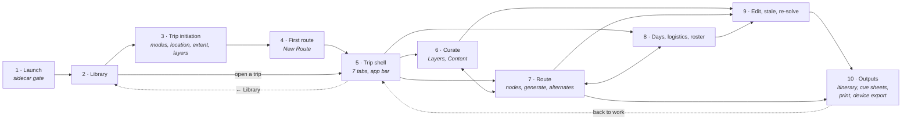

---

## 1 · Launch — the sidecar gate

`main.dart` · `presentation/widgets/sidecar_gate.dart`

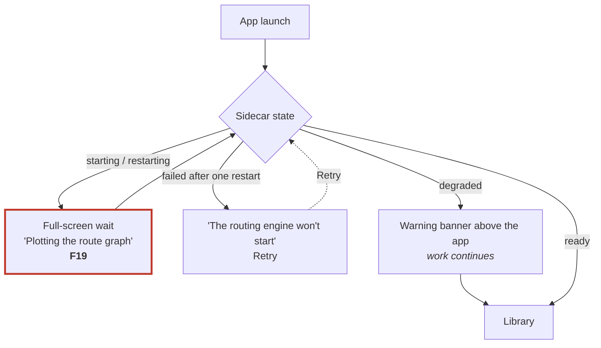

---

## 2 · Library

`presentation/screens/trip_library_screen.dart`

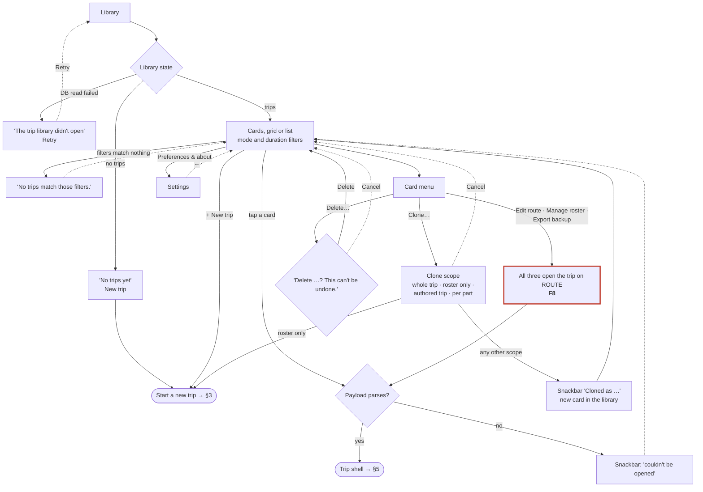

---

## 3 · Trip initiation (steps 1–3 of 4)

`trip_mode_prompt.dart` · `trip_location_prompt.dart` · `trip_area_screen.dart` ·
`map/trip_area_map.dart` · `trip_layers_screen.dart` · `state/trip_bbox_provider.dart`

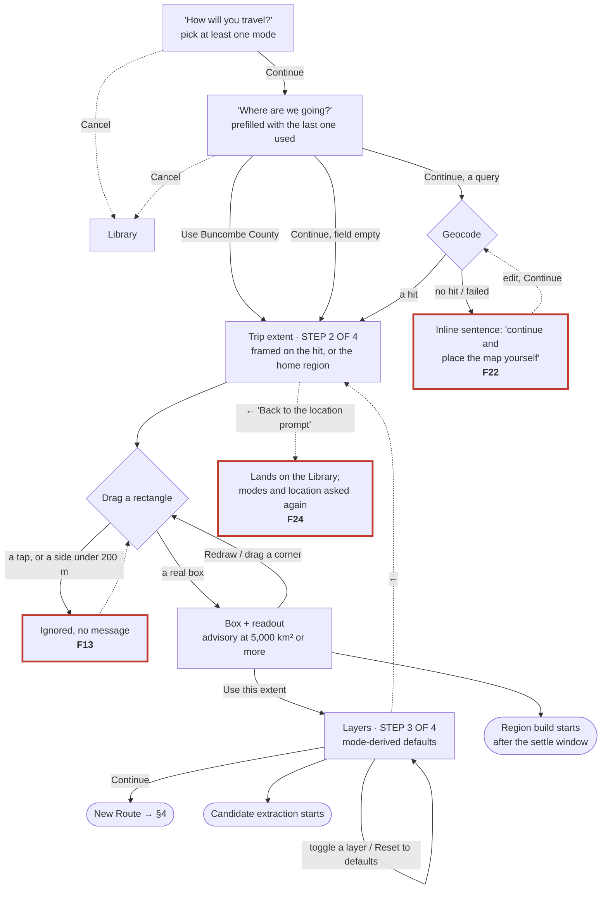

---

## 4 · First route — New Route (step 4 of 4)

`presentation/screens/new_route_screen.dart` · `widgets/error_states.dart`

New Route is reached from two places: trip creation, and *+ New route day*, *Add a passage* or *Add
segment* inside the shell (§7). It draws the same screen both times. **F7**

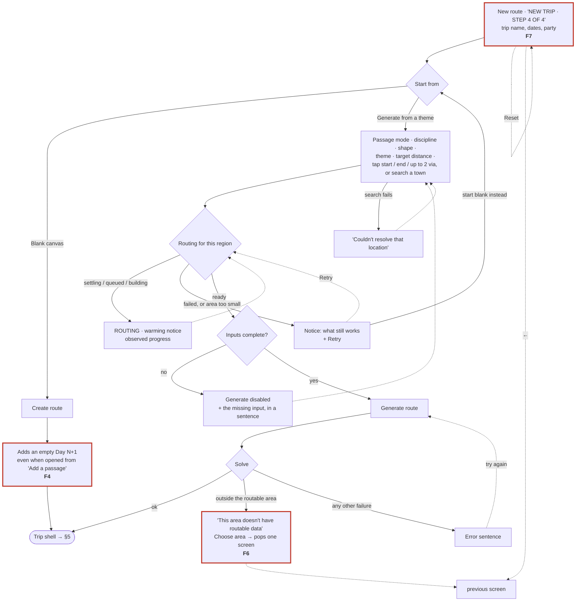

---

## 5 · The trip shell

`presentation/screens/trip_shell_screen.dart`

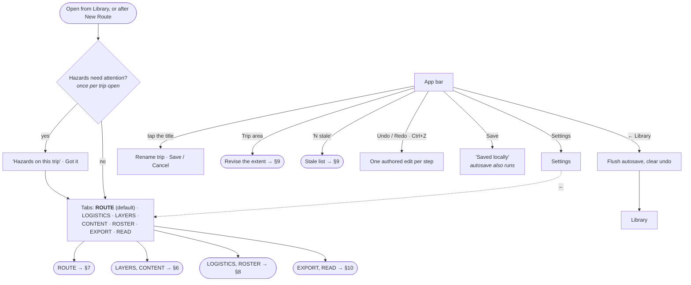

---

## 6 · Curate — Layers and Content

`plan_tabs/layers_tab.dart` · `plan_tabs/proposals_view.dart` · `plan_tabs/content_tab.dart` ·
`widgets/anchor_promotion_panel.dart`

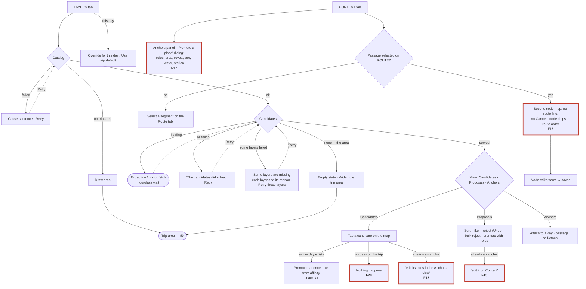

---

## 7 · Route — nodes, generate, alternates

`plan_tabs/route_tab.dart` · `widgets/weights_rail.dart` · `widgets/metrics_rail.dart` ·
`widgets/route_through_list.dart` · `widgets/node_editor_sheet.dart` ·
`state/current_trip_provider.dart`

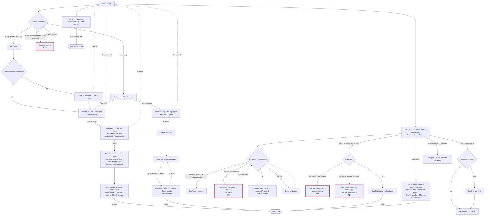

---

## 8 · Days, logistics and roster

`plan_tabs/logistics_tab.dart` · `rest_day_location_screen.dart` · `plan_tabs/roster_tab.dart`

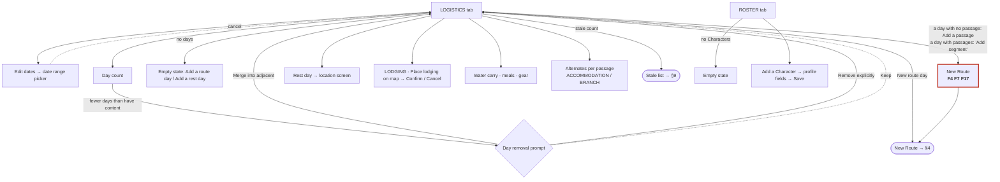

---

## 9 · Edit, stale and re-solve

`widgets/stale_list_dialog.dart` · `widgets/trip_bbox_shrink_prompt.dart` ·
`state/current_trip_provider.dart` (`_edit`, `markSegmentStale`, `resolveAllStale`)

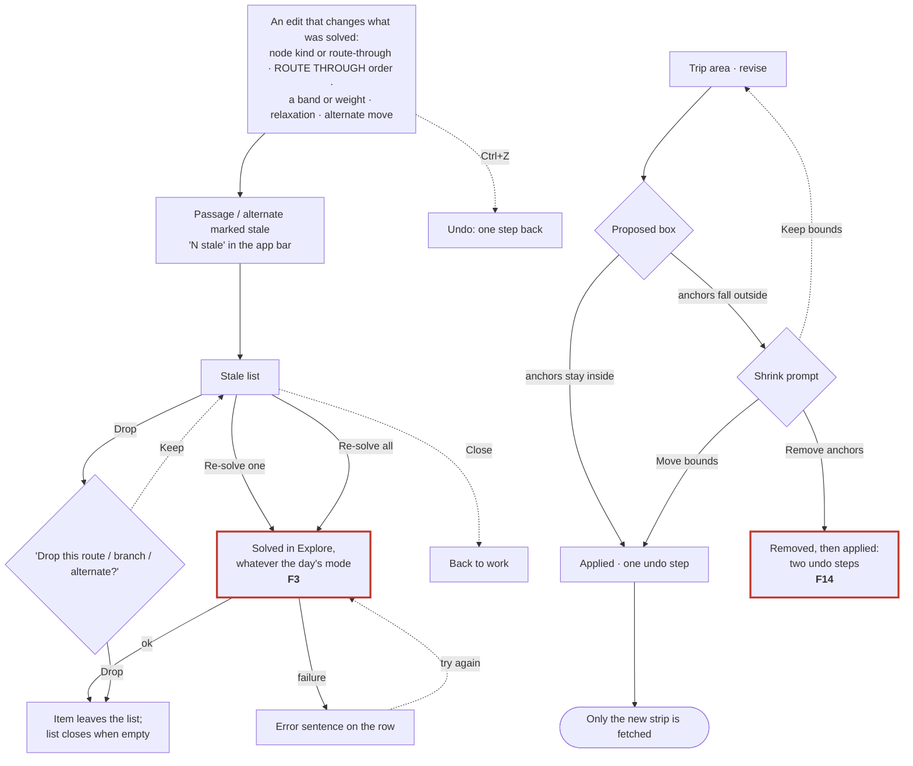

---

## 10 · Outputs — itinerary, cue sheets, print, device export

`plan_tabs/export_tab.dart` · `widgets/print_preview.dart` · `widgets/stale_list_dialog.dart` ·
`data/export/fit_writer.dart` · `data/routing_client.dart` (`cuesFor`)

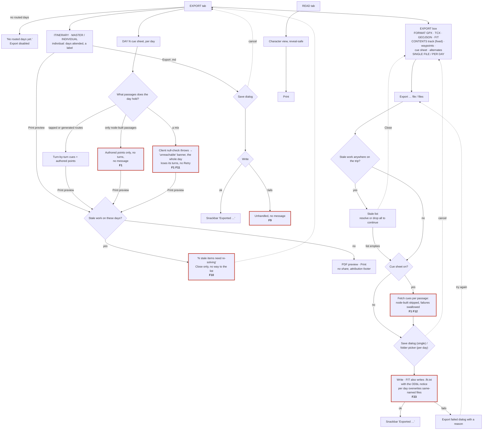

---

## 11 · Findings

Severity: **High** means wrong output, a crash, or work silently lost. **Medium** means a dead end
or a path that misleads. **Low** means copy or consistency. Each finding was traced in code at
`a3245b3`; none has been reproduced on the desktop app yet. Line numbers are under `client/lib/`
unless stated.

| ID | Sev | Stage | Finding | Evidence |
|---|---|---|---|---|
| **F1** | High | 10 | **A passage built from nodes (#626/#640) gets no turn-by-turn cues anywhere.** Such a passage has no stored `start` (D71), and every cue path keys on `start`. If a day holds only node-built passages, its cue sheet is authored points only, with no message. If a day mixes them with tapped routes, `cuesFor` hits a null check, the day shows the *"unreachable"* banner, and **the routed passages lose their turns too**. Device export with *Cue sheet* on skips them silently, so a FIT file ships with no turns. | `plan_tabs/export_tab.dart:695`, `:1063`; `data/routing_client.dart:373` |
| **F2** | High | 7 | **Diagnose crashes on a node-built passage.** `segment.start!` is null there. Only `RoutingException` is caught, so the button resets and nothing is said. The poll loop has no deadline either, and the `StateError` for a missing bbox isn't caught. | `widgets/weights_rail.dart:745`, `:765`, `:740` |
| **F3** | High | 9 | **The stale list re-solves every item in Explore,** including passages on a Compose day. Weights convert per mode (Compose drops `interest`) and so does the target, so the re-solved route can differ from the one the rail's own button would give. This covers *Re-solve*, *Re-solve all*, and both export/print stale gates. | `widgets/stale_list_dialog.dart:189`, `:148`; `state/current_trip_provider.dart:2168` |
| **F4** | High | 4, 8 | **"Add a passage" plus Blank canvas adds a new empty day** instead of a passage on the day the Author picked. `_createBlank` ignores `plannerTargetDayIdProvider` and leaves it set, so the next New Route can target a stale day. | `screens/new_route_screen.dart:787` |
| **F5** | Med | 7 | **Inside the shell, a region still building reads as an error.** Generate / Regenerate are enabled while the graph builds. The sidecar's 503 comes back as a red `ConflictBanner`, not the hourglass wait with progress. Only New Route shows routing readiness. This breaks the design rule that waits are not failures. | `widgets/weights_rail.dart:527`, `:565`; `service/plotlines_service/app.py:3473` |
| **F6** | Med | 4 | **"Choose area" on New Route pops one screen,** which lands on the layer step during creation, or back in the shell when adding a day. Neither is the trip area. | `screens/new_route_screen.dart:612` |
| **F7** | Med | 4 | **New Route always reads "NEW TRIP · STEP 4 OF 4"** and shows the trip-name / dates / party block, even when it is opened to add a passage to an existing trip. | `screens/new_route_screen.dart:219` |
| **F8** | Med | 2 | **Three library card actions do one thing.** *Edit route*, *Manage roster & preferences* and *Export backup* all open the trip on ROUTE. *Export backup* has no backup behind it (it is story L3, #127). | `screens/trip_library_screen.dart:555` |
| **F9** | Med | 10 | **The itinerary `.md` export has no catch.** A write failure is an unhandled exception with nothing on screen, unlike the device export, which has a dialog. | `plan_tabs/export_tab.dart:244` |
| **F10** | Med | 10 | **Print blocked by stale work is a dead end.** The dialog says *"open the stale list from Export"* but offers only *Close*. | `widgets/print_preview.dart:169` |
| **F11** | Med | 10 | **A failed cue derivation has no Retry.** The day only reloads when the day or trip changes. | `plan_tabs/export_tab.dart:768` |
| **F12** | Med | 10 | **Device export swallows per-passage cue failures** (`catch (_) {}`) and still says *"Exported …"*. | `plan_tabs/export_tab.dart:1067` |
| **F13** | Low | 3 | **A drag with a side under 200 m is ignored with no message** (#628's guard). The Author sees nothing happen. | `map/trip_area_map.dart:156` |
| **F14** | Low | 9 | **Shrinking the area and removing anchors makes two undo steps** (*Remove N places* and *Change the trip area*) for one decision. | `screens/trip_area_screen.dart:106` |
| **F15** | Low | 6 | **Anchors have two editors:** the Layers tab's *Anchors* view and the Content tab panel. The two duplicate-promotion snackbars point at different ones. | `plan_tabs/layers_tab.dart:412`; `plan_tabs/proposals_view.dart:379` |
| **F16** | Low | 6 | **The Content tab is a second node-placement map.** It has no route line and no gesture panel or Cancel, and it centres on `segment.start`, which is null for a node-built passage. | `plan_tabs/content_tab.dart:84` |
| **F17** | Low | 6, 7, 8 | **Copy leaks internals.** Labels carry FR numbers (*FR106*, *FR108*, *FR25*, *FR109*). One sentence names a *"Curation"* tab that doesn't exist. *Segment* and *passage* are used for the same thing (*Add segment*, *Select a segment*). | `widgets/anchor_promotion_panel.dart:941`, `:972`, `:1172`; `widgets/weights_rail.dart:1302`; `plan_tabs/logistics_tab.dart:505`; `plan_tabs/content_tab.dart:67` |
| **F18** | Low | 7 | **A day that has passages, with none selected, offers no map action.** The node-built path (#626) can only start a passage on an *empty* day. A second one on the same day has to go through New Route. | `plan_tabs/route_tab.dart:600–655` |
| **F19** | Low | 1 | **The sidecar start screen says "Plotting the route graph"** while the engine is only starting. No graph is involved yet. | `widgets/sidecar_gate.dart:73` |
| **F20** | Low | 6 | **Tapping a candidate on a trip with no days does nothing** and says nothing. | `plan_tabs/layers_tab.dart:390` |
| **F21** | Low | 7 | **Diagnose is disabled with an empty tooltip** when bands exist but nothing is solved yet. | `widgets/weights_rail.dart:551` |
| **F22** | Low | 3 | **The location error says "continue and place the map yourself"**, but *Continue* re-runs the geocode. The way on is *Use Buncombe County* or clearing the field. | `widgets/trip_location_prompt.dart:147`, `:163` |
| **F23** | Low | 10 | **Per-day export overwrites same-named files** in the chosen folder without asking. | `plan_tabs/export_tab.dart:1147` |
| **F24** | Low | 3 | **Trip extent's ← says "Back to the location prompt"** but lands on the Library, because the prompts were dialogs over it. Going forward asks for modes and location again. | `screens/trip_area_screen.dart:164` |

**Proposed grouping into issues.** These group by fix, not one issue per finding:
1. **Node-built passages through the output pipeline:** F1, F2, F16. This is the #626/#640 follow-on. The fix is one helper that resolves a passage's effective start (`routeSolveInputs`) for cues, Diagnose and the Content map.
2. **Stale re-solve honours the day's planning mode:** F3.
3. **New Route opened from the shell:** F4, F6, F7. Target the picked day, drop the creation chrome, and send *Choose area* to the trip area.
4. **Routing readiness inside the shell:** F5.
5. **Export and print dead ends and silent failures:** F9, F10, F11, F12, F23.
6. **Library card actions:** F8. Deep-link the tab, and hide *Export backup* until L3 (#127).
7. **Copy and consistency sweep:** F13, F14, F15, F17, F19, F20, F21, F22, F24.

---

## 12 · Diff against the drawn flows (`Plotlines_Author_Flows_MVP.md` v1.6)

| Drawn flow | What the code does | Verdict |
|---|---|---|
| **Flow 1:** modes → location → bbox → layers → first route; the region graph gates routing only | Matches, as STEP 1–4 of 4. Routing readiness is shown on New Route only. | Matches. Readiness inside the shell is missing (**F5**). |
| **Flow 1:** a roster-only clone runs initiation; other scopes skip it | Matches (`runsTripInitiation`). | Matches. |
| **Flow 2:** select layers → candidates → promote / proposals | Matches. A candidate tap promotes in one step with its role taken from affinity. | Matches. Two anchor editors (**F15**). |
| **Flow 4:** Explore and Compose; switch with no work lost | Matches in the rail. | Matches. The stale re-solve ignores the mode (**F3**). |
| **Flow 4:** conflict named, relaxations offered | Diagnose → conflict dialog → apply. | Matches, except for node-built passages (**F2**). |
| **Flow 5 / Coverage:** C4 alternates and C5 waypoints listed as *not drawn* | Both are built: the draft / move bars (#324, #344), plus node placement (#588) and route-by-nodes (#626, #640). | **The drawn set is behind the code.** Flow 11 lives only in the design skill. |
| **Flow 6:** cue sheet, reveal-aware, print; export GPX / TCX / FIT, stale-gated, print blocks with no override | Gating matches. Cues are missing for node-built passages. | **F1**, **F10**. |
| **Flow 8:** *never a silent failure* | Silent at **F1**, **F2**, **F9**, **F12**, **F13**, **F20**. | Six violations. |
| **Flow 8:** waits are not failures (D67, #573) | Holds in the curation tabs and on New Route. Inside the shell, a routing wait reads as an error. | **F5**. |
| **Flow 9:** stale, not chased; the stale list resolves or drops | Matches. | Matches, apart from **F3**. |
| **Flow 10:** undo is one step per authored edit | Holds, except the shrink-and-remove path. | **F14**. |
| **Not in any drawn flow:** library card actions, sidecar gate, READ tab print | Built (G2 is P1). | Drawn here for the first time. |

---

## 13 · Keeping this current

- Re-trace a stage when a PR changes its screens. The `file:line` refs in §11 go stale first, so
  re-check them, and give the change log a row.
- Any new Author flow gets a widget-level flow test, shaped like `route_by_nodes_flow_test.dart`,
  that walks its main path. That makes a broken step in this diagram a failing test.
- When a finding is fixed, strike it in §11 and remove its red outline from the diagram in the
  same PR.

## Change log

| Version | Change |
|---|---|
| **1.0** | First code trace, 2026-10-07, at `a3245b3`. Eleven diagrams (the spine plus ten stages) and 24 findings (F1–F24). Diff against `Plotlines_Author_Flows_MVP.md` v1.6. |
