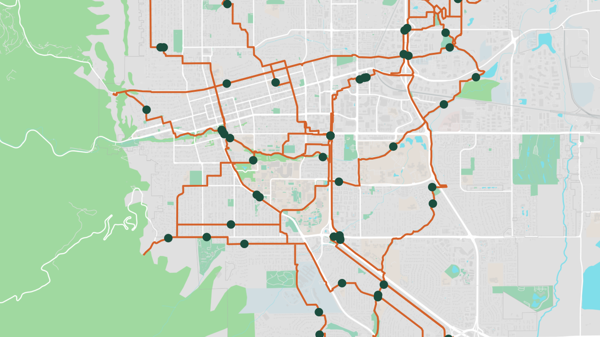
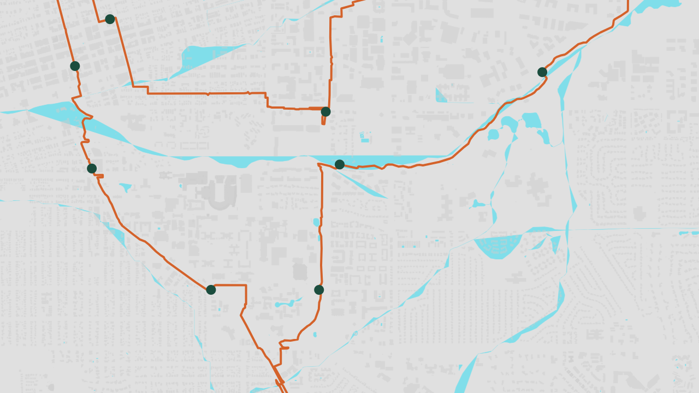

# SPIKE-14 — Vector mapping: `maplibre_gl` + PMTiles

**Run:** 2026-08-15 · **Verdict:** **negative on the named hypothesis, positive on the goal.**
`maplibre_gl` cannot be used on Flutter desktop at all. A different stack —
`flutter_map` + `vector_map_tiles` — renders a real routed polyline with node markers
over a correct vector basemap, offline, on Flutter Linux desktop, and is fast enough.
The basemap source and its licence are settled. Two things did **not** clear: the
second desktop platform was not tested, and reading PMTiles *inside the Flutter client*
is currently blocked by a dependency conflict — which the already-decided FR92 service
contract happens to route around.

---

## 1. `maplibre_gl` is not viable on desktop — and neither is its successor

This is the finding that reshapes the spike, and it took two steps to establish because
the obvious source of truth is wrong.

**`maplibre_gl` 0.26.2 does not support desktop.** Its pub.dev platform tags are
`android, ios, web`. There is no Linux, Windows, or macOS implementation. Nothing to
test.

**Its successor, `maplibre` 0.3.5, advertises desktop support that does not exist.**
pub.dev tags it `android, ios, windows, linux, macos, web` — six platforms, including
all three desktops. That tag list is what a technology-choice note would be written
from, and it is misleading. The package's own plugin manifest declares only three
implementations:

```yaml
platforms: {android: maplibre_android, ios: maplibre_ios, web: maplibre_web}
```

Built and run on Linux desktop to be sure, because a manifest is still not a
measurement. It compiles and links cleanly, the window opens, the widget tree builds —
and then:

```
UnsupportedError: MapLibre is not supported on this platform.
  at MapLibrePlatform.createWidgetState
     (maplibre_platform_interface/src/platform_interface.dart:31)
```

The failure is at widget construction, not at build time. A project that took the
pub.dev tags at face value would discover this after wiring a map into every Author
Desktop screen.

**Consequence:** the "which map package" half of this spike is answered by elimination,
not by comparison. MapLibre's Flutter bindings — the GPU-native path — are mobile and
web only. Anything Plotlines draws on desktop is drawn by Flutter itself.

---

## 2. What does work: `flutter_map` + `vector_map_tiles`

The alternative is a pure-Dart stack that rasterizes vector tiles onto Flutter's own
canvas: [`flutter_map`](https://pub.dev/packages/flutter_map) 8.3.1 +
[`vector_map_tiles`](https://pub.dev/packages/vector_map_tiles) 9.0.0-beta.11 +
`vector_tile_renderer` 6.1.0. It renders correctly and offline:



That is the `multi` payload — 6,864 real route vertices and 60 node markers over
Boulder — drawn with the process inside a network namespace with no route and no DNS
(`unshare -rn`). Roads, parks, landuse, water and buildings all render. **P2's
offline-first claim holds for the map layer.**

### 2.1 But the working combination is pre-release, and the stable one is broken

This is the single biggest risk the spike found, and it is a supply-chain risk rather
than a technical one.

| Package | Last **stable** | Supports | Renders Protomaps v4? |
|---|---|---|---|
| `vector_map_tiles` | **8.0.0** (2024-08-16) | `flutter_map ^7`, renderer `^5.2.1` | **No — roads and labels missing** |
| `vector_map_tiles` | 9.0.0-beta.11 (2026-07-23) | `flutter_map ^8.1.1`, renderer `^6.1.0` | Yes, except labels |

The last stable release is two years old and holds `flutter_map` a major version back.
Worse, its renderer (5.2.1) silently fails to draw **roads** from the current Protomaps
v4 basemap — the road paint uses `["interpolate", ["exponential", 1.6], ["zoom"], …]`
expressions it cannot evaluate, so line widths collapse and the roads vanish. Nothing
throws. The first render from this spike looked like this:



Buildings and water are correct; every road is gone. For a route-planning product that
is not a cosmetic defect — it is an unusable basemap that reports no error. Swapping
*only* the renderer version fixes it: the same tiles, same theme, same viewport render
roads, parks and landuse correctly at
[`shots/working-day-z15.png`](shots/working-day-z15.png).

**A theme swap does not distinguish the two cases, which is worth recording as method:**
rendering the same tiles with the `light` and `dark` themes produced images differing in
0.04% of sampled pixels, with an identical dominant palette. Colour is not evidence that
a theme was applied; a rule that fails to evaluate falls back rather than erroring.

### 2.2 Labels do not render at all

On *both* renderer versions. The Protomaps v4 themes drive every label through
`format` / `case` / `coalesce` / `is-supported-script` expressions for multi-script
name fallback, and `vector_tile_renderer` logs `WARN: Unsupported expression syntax`
for each and draws nothing. Every screenshot in this directory is label-free — no
street names, no place names.

For an Author placing story Nodes on a map, unlabelled roads are a real usability
problem, not a polish item. Options, none yet chosen: use a Protomaps **v3** theme
(older expression syntax, may fare better), author a reduced Plotlines theme with
simple label expressions, contribute expression support upstream, or draw labels as
Flutter widgets from the `places` layer we already receive in the tiles.

### 2.3 PMTiles cannot currently be read inside the Flutter client

The spike's stated fork — *"whether tiles route through the sidecar or the client reads
the PMTiles archive directly"* — is settled by dependency resolution, in the sidecar's
favour.

The `pmtiles` Dart package cannot co-exist with the `vector_map_tiles` line that
supports current `flutter_map`:

- `vector_map_tiles ≥9.0.0-beta.10` requires `latlong2 ^0.10.1`; `pmtiles 1.x` requires
  `latlong2 ^0.9.0`.
- `pmtiles 2.x` fixes that but requires `protobuf ^6`, while the renderer's
  `vector_tile` requires `protobuf ^3`.
- The bridge package `vector_map_tiles_pmtiles` 1.5.0 pins `vector_map_tiles ^8.0.0`,
  i.e. the stale stable that cannot draw roads.

There is no version triple that satisfies all three. The measurements in §3 were
therefore taken with the archive exploded to an `assets/tiles/{z}/{x}/{y}.mvt`
directory and a ~30-line `DirectoryVectorTileProvider`, which isolates the rendering
question from the packaging one.

**This vindicates a decision already taken.** FR92/D21 require the client to fetch
tiles only from Plotlines' own `GET /tiles/{z}/{x}/{y}`. Under that contract the client
never opens a PMTiles archive: the **sidecar** does, in Python, where PMTiles has no
such conflict. The dependency deadlock costs us nothing as long as we hold the line.
Only a "client reads the archive directly" design would be blocked — and that design is
now ruled out on evidence rather than preference.

---

## 3. Performance

Measured on **software rasterization — `llvmpipe`, no GPU** (WSLg exposes no hardware
device; `GL_RENDERER: llvmpipe (LLVM 20.1.2, 256 bits)`). **Every number below is a
floor, not a representative figure.** A machine with a real GPU should do materially
better, and none of these results should be quoted as the expected desktop experience.

5 repeats per cell, median reported, scripted orbit-and-zoom at z14, 1280×720,
profile build. `p95`/`p99` are frame totals; the 60 Hz budget is 16.7 ms.

| Configuration | Vertices | p50 | p95 | p99 | fps p50 | frames over budget | RSS |
|---|---|---|---|---|---|---|---|
| Route only, day | 1,164 | 5.5 ms | 7.2 ms | 8.0 ms | 182 | **0%** | 274 MB |
| Route only, multi | 6,864 | 7.0 ms | 9.2 ms | 11.1 ms | 142 | **0%** | 278 MB |
| Route only, stress | 41,179 | 7.7 ms | 11.1 ms | 12.9 ms | 129 | **0%** | 286 MB |
| Vector basemap, day, cold | 1,164 | 11.6 ms | 26.3 ms | 41.7 ms | 86 | 14% | 676 MB |
| Vector basemap, multi, cold | 6,864 | 13.1 ms | 33.2 ms | 45.5 ms | 77 | 26% | 683 MB |
| Vector basemap, stress, cold | 41,179 | 16.2 ms | 38.3 ms | 51.7 ms | 62 | 47% | 656 MB |
| **Vector basemap, multi, warm** | 6,864 | 11.4 ms | **15.5 ms** | 20.0 ms | 88 | **2%** | 707 MB |
| Vector basemap, multi, **offline** | 6,864 | 13.7 ms | 29.5 ms | 44.8 ms | 73 | 25% | 666 MB |

**Route geometry is free.** Zero frames over budget at every size tested, including a
41,179-vertex polyline — roughly 660 km of real OSM-noded route, far past a realistic
multi-day trip. Rendering the route is not a design constraint, and the client does not
need geometry simplification for the sizes Plotlines will produce.

**The basemap is the entire cost, and it is a first-view cost.** Cold, 14–47% of frames
miss the budget while tiles are decoded and rasterized. Warm — the same viewport
revisited — p95 falls to 15.5 ms, under the 60 Hz budget, and jank drops to 2%. The
tail is tile decode, not steady-state drawing.

**Offline costs nothing.** 73 fps and 25% jank offline against 77 fps and 26% cold
online: the same workload. The network was severed at the OS level, not by a flag.

**Memory is the number to watch.** The basemap costs ~400 MB of RSS over route-only
(~280 MB → ~680 MB). That is a profile build on a software rasterizer and should not be
taken as a shipping figure, but it is large enough that it belongs in the desktop
client's budget rather than being discovered later.

**Cold open is not a problem.** Time from process start to first painted frame:
**10 ms** route-only, **25 ms** with the vector basemap, **48 ms** for the 41k-vertex
payload. Opening a PMTiles archive, separately timed on the earlier stable stack, took
**6 ms**. Nothing here needs a splash screen. Parsing the 71-rule Protomaps style costs
a further ~11 ms, once.

**Variance is high and was itself a finding.** An early pass swung the same
configuration between 34 and 107 fps because a leftover process from the `maplibre`
probe was still holding a CPU. `probes/bench.py` now waits for the load average to fall
before each cell. On a software rasterizer, a single run is not evidence.

---

## 4. Tile source, licence, and attribution — settled

**Source: the Protomaps Basemap**, built from OpenStreetMap with Planetiler and
published as a single PMTiles archive.

- **Licence: ODbL.** Protomaps' own documentation describes it as *"distributed as an
  Open Database License Produced Work (OpenStreetMap attribution required)"*.
- **Attribution string**, carried in the archive's own metadata and therefore
  self-documenting: `© OpenStreetMap` linking to
  `https://www.openstreetmap.org/copyright`. This is an **ODbL** obligation and is
  separate from the elevation layer's **CC BY** obligation (FR86, GEDTM30) — the About
  surface owes both, under different licences.
- **The styles/themes are separately licensed** (CC0 / public domain per the
  `protomaps-themes-base` distribution), so a Plotlines-authored theme derived from
  them carries no attribution burden of its own.
- **Hotlinking is explicitly discouraged**: *"URLs may change and hotlinking to these
  downloads are discouraged. Instead, you should copy the tileset to your own Cloud
  Storage."* Plotlines must mirror, not link.

That last point is the one with architectural teeth, and it independently confirms
FR92/FR94: we host our own tiles and the client talks only to us. Had the client been
allowed to fetch a third-party tile URL, we would be violating the source's own
guidance and pinning a licence obligation onto every device.

Verified live: the daily planet build channel is real and current — `20260815.pmtiles`,
**127.9 GB**, z0–15, serving HTTP range requests (`206`), with BLAKE3 hashes published
for integrity.

---

## 5. Q9 — tile-generation tooling: we probably do not generate tiles at all

ARCH Q9 assumed the choice was `tilemaker` → MBTiles or an alternative, i.e. that
Plotlines runs an OSM-to-tiles pipeline. **Measured, the cheaper answer is to extract
from the published planet build rather than build tiles ourselves.**

`pmtiles extract` pulls a bbox out of the 128 GB planet archive over HTTP range
requests, without downloading the planet:

```
pmtiles extract https://build.protomaps.com/20260815.pmtiles marion-80km.pmtiles \
    --bbox=-82.451,35.324,-81.567,36.044 --maxzoom=15

Region tiles 8949 · 76 total requests · transferred 23 MB (overfetch 0.05)
Completed in 5.95 s → 22 MB archive
```

**Six seconds and 76 requests for an 80 km square.** Running Planetiler ourselves (Java
is present, so it is available) means hours of compute and an OSM extract to babysit,
and buys nothing unless we need layers the Protomaps schema lacks — for example baking
Plotlines' own surface or traffic attributes into the basemap. That is a real future
possibility, but it is not an MVP need.

**Recommendation:** mirror the daily planet build to Plotlines-controlled storage (as
the licence guidance requires anyway), and have the tile service run `pmtiles extract`
per requested bbox. This is exactly FR94's "bbox-scoped, on demand, one pipeline shared
with offline bundles" — and it turns out to be a *cheaper* implementation than a
standing tile server, not a more expensive one. Planetiler stays on the shelf as the
answer to "we need custom layers", not as MVP infrastructure.

---

## 6. Q10 — region sizing: measured

Five real extractions, all z0–15 unless noted:

| Region | Extent | Area | Archive |
|---|---|---|---|
| Marion NC town core (CI fixture) | 5 × 7 km | 36 km² | **1.0 MB** |
| Boulder CO (this spike's fixture) | 16 × 16 km | 252 km² | 5.2 MB |
| Marion NC square, z0–**14** | 80 × 80 km | 6,406 km² | 11.5 MB |
| Marion NC square, z0–15 *(POC reference bbox)* | 80 × 80 km | 6,406 km² | **22.0 MB** |
| WNC multi-day corridor | 235 × 134 km | 31,359 km² | **118.1 MB** |

**Rule of thumb: ~3.5 MB per 1,000 km² at z0–15**, over a fixed floor of ~1 MB (the
low-zoom pyramid, which every archive carries regardless of size). **Capping at z14
halves the size** — 22.0 → 11.5 MB — which is the cheapest single lever if bundle size
becomes a problem, at the cost of the closest zoom level.

Against these numbers the open sub-questions resolve as follows:

- **Minimum useful region.** The POC's cautionary history — a first bbox too small to
  produce real routes, widened to ~80 km — is confirmed as the right order of
  magnitude, and it is cheap: an 80 km square is **22 MB**. Sizing a default region is
  not a storage trade-off at this scale; pick the region that routes well.
- **A small pinned bbox for CI** is comfortable at **1.0 MB** — small enough to be a
  committed fixture if a golden test ever needs one.
- **A multi-day corridor is the case that costs**: 118 MB. This is the number that
  belongs in the FR64 offline-package budget and in ARCH §11.3, and it argues for
  per-trip corridor extraction over shipping fixed named regions.
- **Fixed regions vs. per-trip bbox** is therefore answerable on evidence now:
  **per-trip bounding box**, because a corridor bundle is an order of magnitude larger
  than a local region and only the trip knows which corridor it needs. This remains a
  recommendation rather than a decision — it is a product call, not a measurement.
- **First-run with nothing downloaded** is still unanswered; nothing here measures it.

---

## 7. What did not clear

- **The second desktop platform.** Only Linux was tested. Flutter's Windows toolchain
  is not reachable from WSL, so `flutter build windows` could not run. The stack is
  pure Dart with no platform channels, and `flutter_map`/`vector_map_tiles` both carry
  Windows platform tags — but §1 is precisely a case of platform tags being wrong, so
  this is **untested, not "probably fine"**. The harness is environment-driven and will
  run as-is on a Windows Flutter install; that is the cheapest way to close this.
- **Labels** (§2.2). No basemap text renders at all. Needs a decision.
- **GPU performance.** Everything here is software-rasterized. The numbers are a floor,
  and the memory figure especially deserves re-measurement on real hardware.
- **Pre-release dependency.** The working stack depends on a beta. Shipping on it, or
  waiting for `vector_map_tiles` 9 stable, is a call this spike surfaces rather than
  makes.

---

## 8. Recommendations

1. **Drop `maplibre_gl` and `maplibre` from the desktop plan.** Neither works. This is
   an elimination, not a preference.
2. **Adopt `flutter_map` + `vector_map_tiles` + `vector_tile_renderer` 6.x** for the
   Author Desktop map, tracking the 9.x line and its stable release.
3. **Keep tiles behind the sidecar (FR92/D21) and do not pursue client-side PMTiles.**
   The Dart dependency deadlock makes the alternative unbuildable today, and the
   contract we already committed to routes around it.
4. **Mirror the Protomaps daily planet build; extract per-bbox on demand** rather than
   generating tiles (§5). Record ODbL/OSM attribution alongside the elevation layer's
   CC BY (§4).
5. **Budget ~3.5 MB per 1,000 km² at z0–15** for offline packages, and treat z14 as the
   size-relief lever (§6).
6. **Close the two open items before the map is built on**: run the harness on Windows,
   and pick a labels approach.
