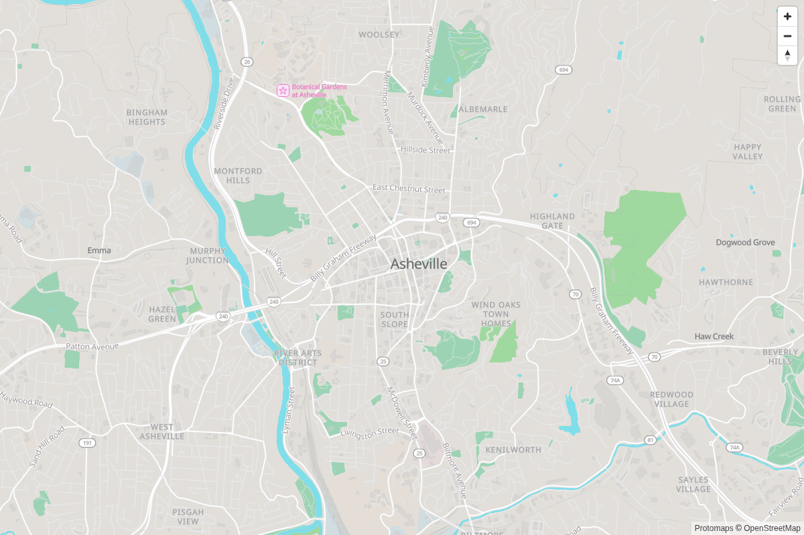
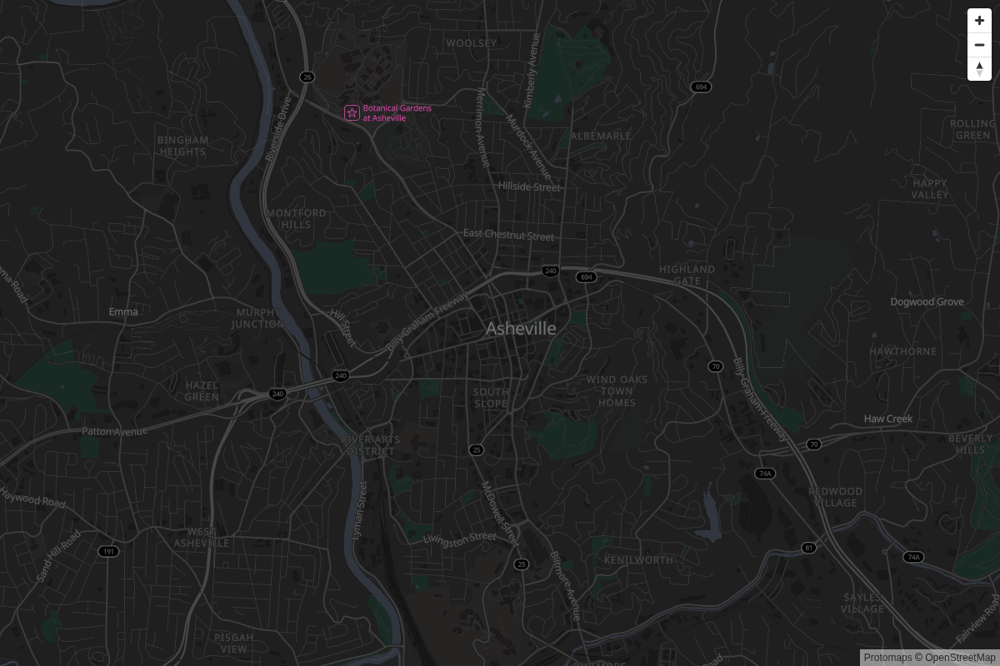
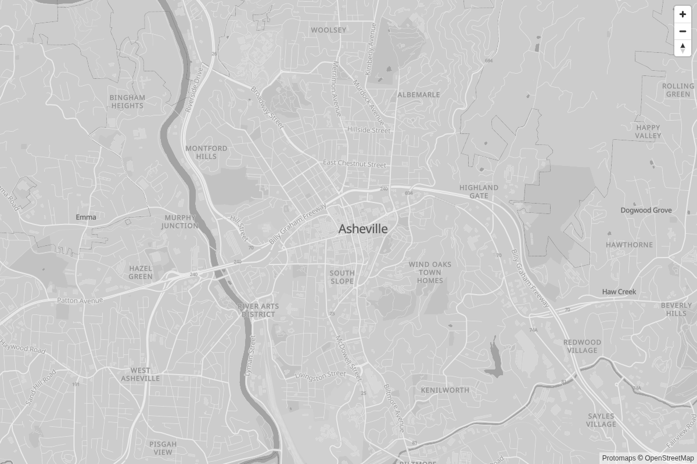
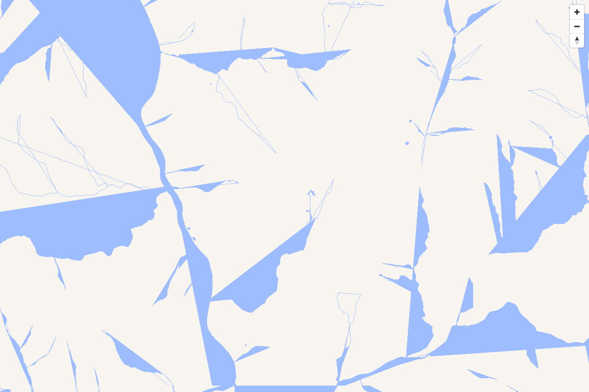
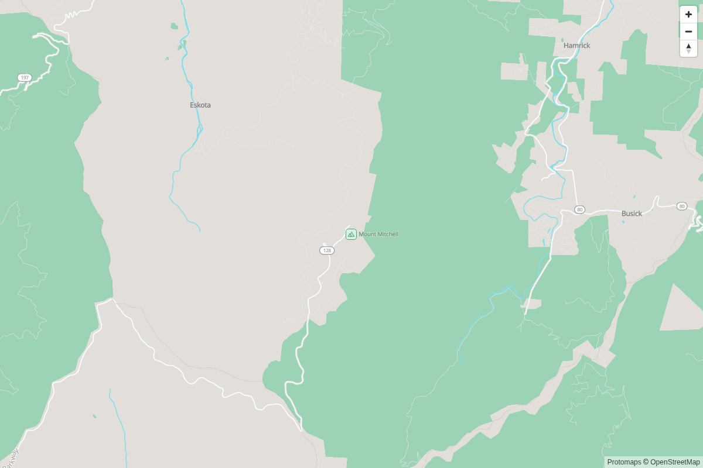
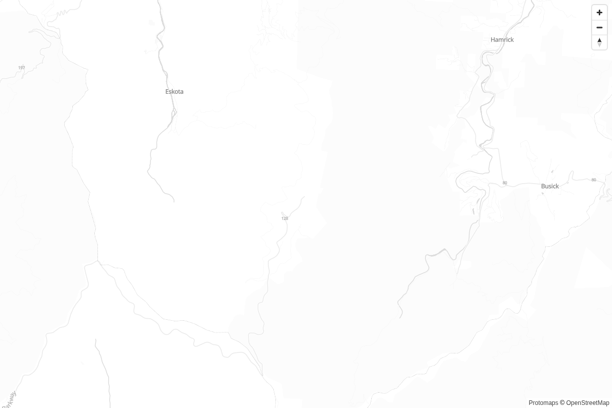
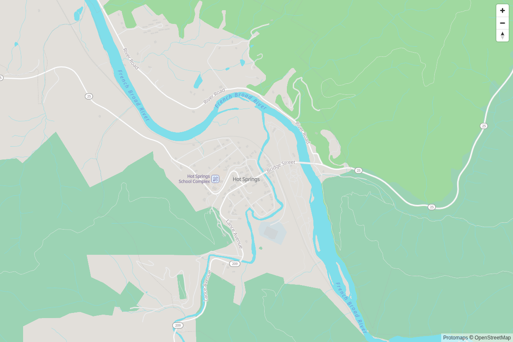
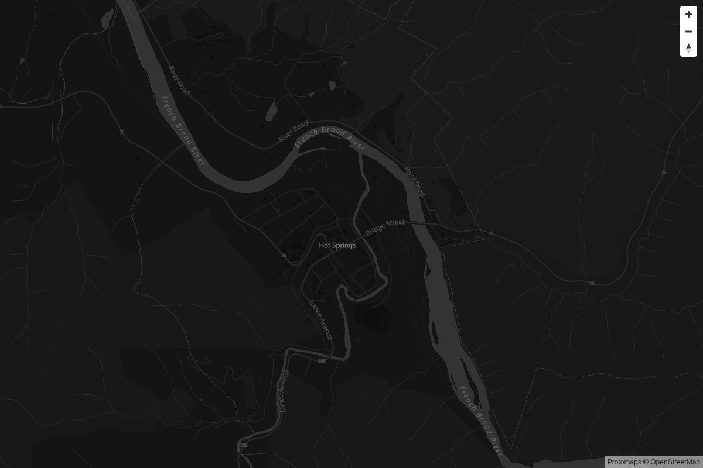

# SPIKE-K — Swappable basemap style JSONs against the Protomaps corridor extract

Issue [#461](https://github.com/gnfrazier/plotlines/issues/461). Run 2026-09-20 against the
live mirror (`http://tiles.plotlines.app/basemap/protomaps/20250101-wnc/corridor.pmtiles`,
the archive #394 cut — Protomaps Basemap tileset **v4.15.2**, 118 MB, 43,329 tiles, OSM
replication 2026-08-15). No new archive, `tiles/extract.py` untouched, no product code
touched.

**Result: positive, with the two OpenMapTiles candidates swapped out on the schema check,
as the issue anticipated.** All five Protomaps-native flavours render cleanly against the
real extract with **zero** schema changes; OSM Liberty and OSM Bright do not render as-is
and would need a real schema port (11 of their 14 source-layers don't exist in a Protomaps
archive — 89–87% of their layers are dead by construction, and the one layer that *does*
draw, draws wrong). Switching is a style-JSON swap: 340–420 ms in the harness, no reload,
zero camera drift, and the shipped Flutter client already does exactly this swap between
Light and Dark on app brightness. **Recommendation for #457: default to Protomaps Light,
keep Dark as the appearance-setting pair — which is what ships today — and do not offer
Grayscale/White/Black as a product default**: upstream defines them without `pois` or
`landcover` layers and without a sprite sheet, so they draw no POIs, no woods/parks
distinction, and road shields as bare numbers.

## Layout

```
harness/index.html            MapLibre GL JS page: 7 styles, keys 1–7 / dropdown, no reload
harness/serve.py              same-origin static server + Range proxy to the mirror (§5.1)
harness/styles/*.json         the candidates, verbatim (§1 says where each came from)
probes/gen_protomaps_styles.mjs  the five Protomaps flavours from upstream's own generator
probes/schema_check.py        static: source-layers + attribute keys vs the archive's metadata
probes/shoot.py               headless: every style × every camera → shots + feature counts
results/schema_check.json     §2's numbers
results/render_check.json     §3's numbers
results/shots/                21 PNGs, 1200×800, three cameras × seven styles
```

`probes/node_modules/` is not committed; `probes/package.json` pins the one dependency.

## Reproducing

```bash
# 1. Generate the five Protomaps styles (deterministic — byte-identical on re-run)
cd spikes/SPIKE-K/probes && npm ci && node gen_protomaps_styles.mjs

# 2. Fetch the two OpenMapTiles styles verbatim (the ones committed were fetched 2026-09-20)
curl -o ../harness/styles/omt_liberty.json https://tiles.openfreemap.org/styles/liberty
curl -o ../harness/styles/omt_bright.json  https://tiles.openfreemap.org/styles/bright

# 3. Schema check (reads the archive header off the mirror via SPIKE-14's pmtiles CLI)
cd .. && python3 probes/schema_check.py

# 4. Look at it
python3 harness/serve.py            # → http://localhost:8765/  (needs LAN access to the Pi)

# 5. Screenshots + rendered-feature counts (Playwright, outside the repo)
uv venv /tmp/pw && uv pip install --python /tmp/pw/bin/python playwright
/tmp/pw/bin/python -m playwright install chromium
/tmp/pw/bin/python probes/shoot.py
```

The mirror name resolves to the Pi's LAN address through `/etc/hosts` on the dev box
(the runbook's "zero-infrastructure fallback", `deploy/mirror/README.md`); Caddy serves
plain `http://`, so that is the scheme the harness uses. Nothing here contacts a
third-party tile host: the only third-party fetches are the styles' own glyph and sprite
assets (`protomaps.github.io/basemaps-assets`), which the Flutter client does not use at
all (§4).

## 1. The candidates, and where each one came from

The issue asked for "the real, unmodified upstream style" per candidate. What that means
differs by family, and it matters for the comparison's honesty:

| # | Style | File | Provenance | Modifications |
|---|---|---|---|---|
| 1 | Protomaps Light | `protomaps_light.json` | `@protomaps/basemaps` 5.7.2, `layers("protomaps", namedFlavor("light"), {lang:"en"})` | none |
| 2 | Protomaps Dark | `protomaps_dark.json` | same, `"dark"` | none |
| 3 | Protomaps Grayscale | `protomaps_grayscale.json` | same, `"grayscale"` | none |
| 4 | Protomaps White | `protomaps_white.json` | same, `"white"` — **swapped in for OSM Liberty, §2** | none |
| 5 | Protomaps Black | `protomaps_black.json` | same, `"black"` — **swapped in for OSM Bright, §2** | none |
| 6 | OSM Liberty | `omt_liberty.json` | `https://tiles.openfreemap.org/styles/liberty`, fetched 2026-09-20, sha256 `6010998…` | none — kept loadable as the risk-check evidence, not a candidate |
| 7 | OSM Bright | `omt_bright.json` | `https://tiles.openfreemap.org/styles/bright`, fetched 2026-09-20, sha256 `ada317e…` | none — same |

**Protomaps publishes no static style JSON.** The canonical artefact is the `layers()`
function in `@protomaps/basemaps` (the package the issue calls `protomaps-themes-base`,
its former name); maps.protomaps.com and SPIKE-14's `style_light.json` are both its
output. Calling it with a named flavour and no overrides *is* the upstream style. The
npm package's major version (5) diverged from the tileset's (4) — its layers target the
v4 source-layer names and its sprite path is `/sprites/v4/`, and the archive reports
`version 4.15.2`; do not read that as a mismatch.

Two things the generator does that the comparison inherits rather than corrects:

- **Only Light and Dark get a sprite sheet** (`generate_style.ts` attaches one for
  exactly those two). Grayscale/White/Black reference the same `icon-image` names for
  road shields and have nowhere to resolve them, so MapLibre logs
  `Image "US:I-3char" could not be loaded` and draws the shield text with no plate.
- **Grayscale/White/Black are defined without `pois` and `landcover` blocks**
  (`flavors.ts`), so the generator emits 69 layers for them against 71 for Light/Dark —
  no POI layer at all, no wood/grass/scrub fill.

The one runtime patch, in the harness and nowhere else: every *vector* source's `url` is
replaced with the mirror archive (`pmtiles://…`), and any raster source is dropped along
with its layers. The checked-in files carry a placeholder URL. Liberty and Bright each
lose their `ne2_shaded` Natural Earth raster (a z≤6 backdrop on openfreemap's host — never
used at any zoom in this spike and never hotlinked from here) and the two layers on it;
that is why §3 shows them at 109/118 vector layers rather than 111/119 total.

## 2. The schema-risk check — Liberty and Bright are a port, not a patch

`probes/schema_check.py` reads the archive's `vector_layers` metadata (the source-layer
names and per-layer field names Planetiler wrote into the PMTiles header) and, per style,
lists every `source-layer` referenced and every attribute key read in a filter or
data-driven property. Static, so it can't be fooled by a tidy-looking empty map — MapLibre
treats an unknown `source-layer` as "no features here" and raises nothing.

Archive: `boundaries, buildings, earth, landcover, landuse, places, pois, roads, water`.

| Style | vector layers | source-layers used | **missing from archive** | layers dead | keys read but absent |
|---|---|---|---|---|---|
| protomaps_light | 70 | 9 | — | **0 / 70** | `pgf:name*` only (harmless, below) |
| protomaps_dark | 70 | 9 | — | **0 / 70** | same |
| protomaps_grayscale | 68 | 7 | — | **0 / 68** | same |
| protomaps_white | 68 | 7 | — | **0 / 68** | same |
| protomaps_black | 68 | 7 | — | **0 / 68** | same |
| omt_liberty | 109 | 14 | `aerodrome_label, aeroway, boundary, building, park, place, poi, transportation, transportation_name, water_name, waterway` | **97 / 109** | `landcover.class`, `landuse.class`, `water.brunnel` |
| omt_bright | 118 | 14 | same eleven | **103 / 118** | `landcover.class/subclass`, `landuse.class`, `water.brunnel/intermittent` |

The only "absent" keys on the Protomaps side are `pgf:name`, `pgf:name2`, `pgf:name3` —
Planetiler's per-feature glyph-fallback fields for non-Latin scripts, present in the
metadata only on layers where some WNC feature carried one, and read in the style through
`has` / `coalesce` guards. A field-union check flags them; they are a no-op.

**Liberty and Bright against a Protomaps archive:**

- Of their 14 source-layers, only `landcover`, `landuse` and `water` exist by name. Every
  road, path, rail, building, boundary, place label, road label, POI, park and waterway
  line is on a layer the archive doesn't have. That is 97/109 and 103/118 layers that
  cannot draw.
- The three layers that *do* exist filter on OpenMapTiles' `class` / `subclass` /
  `brunnel`; Protomaps carries `kind` / `kind_detail` / `is_bridge`. So `landcover` and
  `landuse` filter down to nothing too. What survives is Liberty's unfiltered `water` fill —
  and it draws *wrong*: Protomaps' `water` layer carries waterway **lines** alongside
  polygons (OpenMapTiles puts them in `waterway`), and a fill layer with no `$type`
  filter triangulates each stream into the slashes in
  `results/shots/asheville-z13__omt_liberty.png`. 55 features drawn against Light's 905
  at the same camera, every one of them a water polygon or a mis-filled stream.
- Fixing this is not a source-layer rename. It is a mapping from OpenMapTiles'
  `transportation.class`/`subclass` taxonomy to Protomaps' `roads.kind`/`kind_detail`,
  from `place.class`+`rank` to `places.kind`+`min_zoom`, from `poi.class`/`subclass`
  to `pois.kind`, splitting `water` by geometry, and so on through ~100 layers — the
  Protomaps project's own answer to "I want Liberty on Protomaps tiles" is the
  `@protomaps/basemaps` flavour system, not a shim. The issue's instruction applies:
  **not this spike's job**, so #4/#5 became White/Black.

## 3. Render check — what actually drew, and the switch cost

`probes/shoot.py` drives the harness headlessly (Chromium + SwiftShader, no GPU), switching
through all seven styles **in-page** at each of three fixed cameras, and records
`queryRenderedFeatures()` per source-layer after each swap alongside the wall time from
"switch requested" to `map.loaded()`. Every style is reached by switching *from the
previous one* rather than reloading, so the "no reload, no lost position" requirement is
exercised rather than asserted: **camera drift after 21 switches = 0.0** in lng, lat and
zoom.

Cameras (all inside `WNC_CORRIDOR_BBOX`): **asheville-z13** (−82.553, 35.595 — town:
roads, water, landuse, POIs, place labels at once), **mitchell-z12** (−82.265, 35.765 —
ridge and parkway: park landuse, the one road, terrain context),
**hotsprings-z14** (−82.828, 35.893 — river town on a long-trail crossing: river, rail,
small-town POIs).

| Style | vector layers | features drawn (ash / mit / hot) | by source-layer at asheville-z13 | style errors | switch ms (median) |
|---|---|---|---|---|---|
| protomaps_light | 70 | **905** / 167 / 264 | roads 681 · landuse 135 · places 25 · water 23 · buildings 23 · earth 9 · boundaries 8 · **pois 1** | 0 | 388 |
| protomaps_dark | 70 | 905 / 167 / 264 | identical to Light | 0 | 373 |
| protomaps_grayscale | 68 | 907 / 166 / 263 | roads 684 · … · **no pois** | 0 (+ missing-sprite warnings) | 363 |
| protomaps_white | 68 | 907 / 166 / 263 | same as Grayscale | 0 (+ warnings) | 353 |
| protomaps_black | 68 | 907 / 166 / 263 | same as Grayscale | 0 (+ warnings) | 360 |
| omt_liberty | 109 | **55** / 13 / 47 | water 55 — nothing else | 0 | 343 |
| omt_bright | 118 | 55 / 13 / 47 | water 55 — nothing else | 0 | 1137 ¹ |

¹ Bright's first two switches paid ~800 ms fetching openfreemap's sprite sheet and glyphs
for text that then had nothing to attach to; its third was 354 ms. Not a rendering cost.

Two readings of the table that a screenshot alone wouldn't give:

- **"0 style errors" is not "renders correctly."** Liberty and Bright raise nothing — the
  empty layers are silently empty. The feature count is the measurement; the error column
  isn't.
- **Grayscale/White/Black draw three more `roads` features than Light** at the same camera
  (684 vs 681) because their shield symbols, with no sprite to collide against, place
  where Light's plates were suppressed by collision. Same data, different label placement
  — a reminder that swapping the style re-runs placement, not just colour.

Switching is ~350–400 ms wall time in MapLibre for a full `setStyle({diff:false})`
including re-fetching no tiles (the source URL is unchanged, so the tile cache is warm) and
re-parsing ~70 layers. The harness forces `diff:false` because two styles from different
generators share nothing; a Light↔Dark swap with `diff:true` would be cheaper still.

## 4. Side-by-side — which read well for Plotlines' use

Same camera, same zoom, same tiles, four shots each below (all 21 in `results/shots/`).

### asheville-z13 — town

| Light | Dark |
|---|---|
|  |  |

| Grayscale | Liberty (risk check) |
|---|---|
|  |  |

### mitchell-z12 — ridge, parkway, park boundary

| Light | White |
|---|---|
|  |  |

### hotsprings-z14 — river town, trail crossing

| Light | Black |
|---|---|
|  |  |

Reading them against the three things the issue names — trip corridors, POIs, terrain
context — and against what Plotlines draws *on top* (the Blaze route line, the
shape+mark node markers the brand guide requires, the salience-gated candidate layer from
SPIKE-G):

- **Light** is the only flavour that carries all three at once. Parks and woods are
  distinguishable from built land (the green in the Mount Mitchell and Hot Springs shots is
  the whole "terrain context" the basemap can give — see §5.3 on what it can't), water is
  water-coloured, shields are plated, POIs render with icons (Botanical Gardens, the Mount
  Mitchell park entrance, the school). The palette is muted enough that a saturated route
  line and coloured markers will sit on top of it rather than compete. It is what ships.
- **Dark** keeps every layer Light has and reads well at the town camera; at z12 the park
  fill is a barely-there green on near-black and the ridge reads as void. Fine as the
  paired appearance theme — the app's dark mode is a brightness choice, not a mode (#319) —
  and not a candidate for the *default*.
- **Grayscale** is legible and gives the overlay maximum contrast headroom, but it has no
  POIs and no landcover by upstream definition, water is a darker grey (the French Broad is
  a road-coloured band), and shields are bare numbers. It would be a reasonable
  Author-selectable "quiet" theme once the candidate layer is dense; not a default.
- **White** loses the park boundary almost entirely at z12 (a hairline on white) and
  water goes grey. It is a print/wireframe backdrop, not a planning surface.
- **Black** loses park landuse completely at z14 (Hot Springs' surrounding national-forest
  fill is indistinguishable from the background) — the one flavour that actively removes
  terrain context. Not a candidate.
- **Liberty / Bright** — §2. Water slashes and nothing else.

## 5. Findings beyond the spike question

### 5.1 The mirror sends no CORS headers — a browser cannot read it cross-origin

`deploy/mirror/Caddyfile` sets `Cache-Control` and nothing else; there is no
`Access-Control-Allow-Origin`, and no `Access-Control-Expose-Headers` for `Content-Range`.
That is correct for every consumer that exists today — the sidecar's `http_range_source`
and the Flutter client are not browsers — and it is why this harness runs behind
`harness/serve.py`, a same-origin Range proxy, rather than pointing `pmtiles://` at the
mirror directly (Chromium refuses the first range request before a byte moves). Any web
reader that draws the basemap in a browser (SPIKE-F's Leg 4 surface, Phase 4 hosted) will
hit the same wall. Filed as a `later`/`web` issue rather than fixed here, because the
right answer is a decision about *which* origins, not a `*`: **#463**.

### 5.2 The label fix from SPIKE-14 applies to every flavour, mechanically

The shipped client renders through `vector_map_tiles`, not MapLibre, and SPIKE-14 found it
draws no labels from the upstream style until two constructs are rewritten
(`probes/simplify_labels.py`: `text-field` → `["get","name"]`, expression-form `in` →
legacy `in`). Dry-running that transform against all five generated flavours:

| Flavour | symbol layers with `text-field` | exotic `text-field` to rewrite | `in` filters to downgrade |
|---|---|---|---|
| light, dark | 13 | 10 | 2 |
| grayscale, white, black | 12 | 9 | 1 |

The counts differ only by the `pois` layer the three background flavours lack. The
transform is flavour-independent, so "a Plotlines-authored theme generated in the tile
pipeline" (SPIKE-14's recommendation) is one script over N flavours, not N hand-tweaked
files. (SPIKE-14 reported 10 layers and 1 filter against the generator version it
extracted; 5.7.2 has grown one more expression-form `in` on Light/Dark. The transform
caught it without change.)

### 5.3 "Terrain context" is not in the basemap, in any flavour

None of the Protomaps flavours — nor Liberty/Bright on their own tiles — carry hillshade or
contours; the tileset has no terrain layer. What the shots call terrain context is
landuse (park/forest fill) and the road network's shape. Relief, if Plotlines wants it
under a route, comes from the elevation seam (M3/M10, OpenTopography gated on #148/FR87),
not from a style choice. No basemap comparison will settle it.

### 5.4 The shipped client already does the swap

`client/lib/presentation/map/trip_area_map.dart` calls
`MapTileAssets.theme(isDark ? 'dark' : 'light', …)`, which loads
`client/assets/map_style/style_<name>.json` by name and parses it with `ThemeReader` —
SPIKE-14 measured that parse at 2.7 ms on the transformed style. The two files there are
the transformed Protomaps Light and Dark (with #321's waterway-label contrast edit). So on
the client side, a theme is already a string, and an Author-facing choice is a
preference that feeds that string plus one more asset per flavour. Nothing needs to be
hardcoded, and nothing is.

## 6. What this decides

1. **Every Protomaps flavour renders cleanly against the corridor extract with no schema
   change.** OSM Liberty and OSM Bright do not, and cannot without a ~100-layer taxonomy
   port that is upstream's flavour system by another name. They are not viable for #457
   without that labour, and the labour is not worth it — Protomaps' own flavours cover the
   light/dark/neutral space they'd be ported for.
2. **#457's production default should be Protomaps Light, paired with Dark for the dark
   appearance** — the two flavours upstream ships a sprite for, the two with POI and
   landcover layers, and the two the client already carries. This confirms SPIKE-14's
   one-theme choice with a comparison behind it rather than by default.
3. **Switching is a style-JSON swap and is cheap enough for an Author-facing theme choice
   later**: ~350–400 ms full swap in MapLibre with zero camera drift; a name-keyed asset
   load plus a ~3 ms parse in the client that ships. If that choice is ever offered,
   Grayscale is the one worth adding (maximum contrast headroom for a dense candidate
   layer); White and Black are not planning surfaces on this data.
4. **The theme should keep being generated, not hand-edited** — §5.2's transform is
   flavour-independent, which is what makes "generated in the tile pipeline" true for more
   than one flavour.

Nothing here touches #453–#457's code paths. The harness is throwaway; the style files,
probes and results are the evidence.
